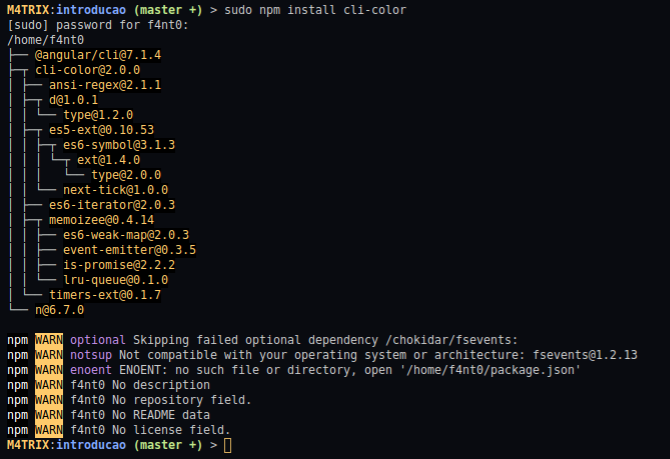

# Primeiros Exemplos com Node

* Node.js ajuda a poder Desenvolver Back-end e Front-end com Javascript


### Primeiro Exemplo

* Criei um arquivo chamado _app.js_ que vai compilar uma Função de Javascript no Terminal
* Coloquei a seguinte linha de código:

```javascript
console.log("Hello World!");
```
* Esta Linha de Código ajuda a apresentar no Shell alguma informação necessária, tanto no Front-End quanto no Back-End
* Para rodar o Programa com Node, devemos abrir um terminal e colocar o seguinte comando

```shell
> node hello-world.js
```

### Segundo Exemplo

* Agora irei criar uma Função que imprima meu nome no Terminal
* A primeira coisa é criar uma Variavel que guarde a String do meu nome, onde no Javascript não precisamos definir que tipo é a nossa Variável

```javascript
let meuNome = "Gabriel Fanto";
```

* Depois é criado uma Função que simplesmente imprime na Tela a Variável de entrada

```javascript
function imprimeNome(nome){
    console.log("Olá meu nome é ", nome);
}
```

* Agora que temos a função que pega a variável de entrada e coloca no Console.log, chamamos essa Função:

```javascript
imprimeNome(meuNome);
```

* Com isso, quando rodarmos o programa ele vai imprimir o nome armazenado na variável _meuNome_:

```shell
> node imprime-nome.js
> Olá meu nome é Gabriel Fanto
```

### Terceiro Exemplo

* Agora iremos testar como instalar pacotes
* para instalar pacotes usamos o comando **NPM**
* vou testar o pacote _cli-color_ que serve para colorir a saida do programa
* Para baixar o pacote no diretório de seu projeto use o seguinte comando:

```shell
> sudo npm install cli-color
```

* A saida deve ser mais ou menos assim:


* Agora que foi baixado o pacote no diretório do programa, vou chamar o pacote no meu arquivo
* o nome do arquivo de teste é `teste-pacote-cli-color.js`
* para chamar o pacote em uma Variável coloque o seguinte comando

```javascript
let color = require("cli-color");
```

* Agora temos o nosso pacote chamado em nosso arquivo de código, agora podemos usar ele como nos exemplos abaixo:

```javascript
console.log(color.yellow("Mensagem em Amarelo!"));
console.log(color.green("Mensagem em Verde!"));
console.log(color.blue("Mensagem em Azul!"));
console.log(color.red("Mensagem em Vermelho!"));
```